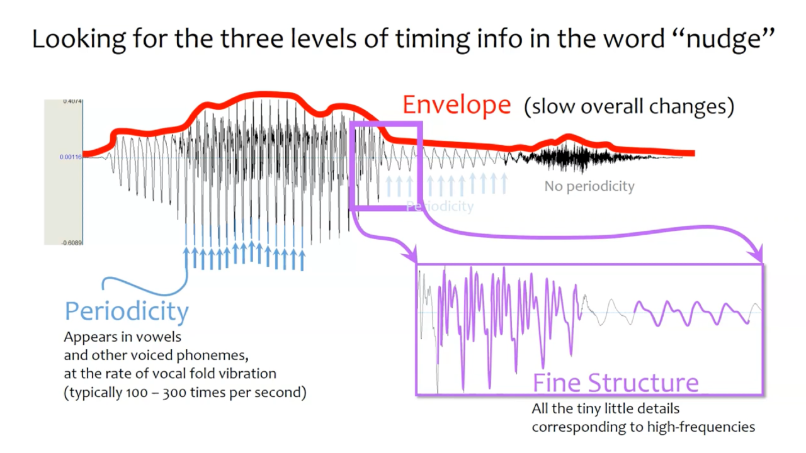

# Envelope & Fine Structure
- This repository contains unofficial implementation of ["A heuristic approach to obtain signal envelope with a simple software implementation"](https://arxiv.org/abs/1703.06812) by [Cecilia Jarne](https://github.com/katejarne) of [National University of Quilmes](http://www.unq.edu.ar/secciones/15-ciencia-y-tecnolog%C3%ADa/). Original code is open under license of GPL v3.0, and this repository follows its license as well.
- This repository also contains notes about signal envelopes and fine structures.

## Concepts
- 신호는 [Envelope과 Fine Structure](https://en.wikipedia.org/wiki/Temporal_envelope_and_fine_structure)의 dichotomy(이분법) 하에 분석될 수 있으며, 오디오 뿐만 아니라 다양한 과학 분야에서 이 피쳐들을 이용.

  - ref: [Listen Lab | Youtube](https://www.youtube.com/watch?v=mYY2cJApFnA)
- Envelope: 전체적인 시간적 정보의 변화
  - 주로 2Hz ~ 50Hz 사이
  - 특정 소리가 어느 시점에서 강조되는가
  - 대략적으로 어떠한 소리, 발음인가
  - 음성 인식에서는 Envelope이 더 중요할 수 있음(ref:[MED-EL | Youtube](https://youtu.be/EYnNpuErlgQ?t=12))
- (Temporal) Fine Structure(=TFS): 세부적인 시간적 정보의 변화
  - Periodicity는 주로 50Hz ~ 500Hz 사이로, 유성/무성음을 구분 가능케함
  - Fine Structure는 주로 600Hz ~ 10,000Hz 사이로, Periodicity보다도 세밀한 정보를 나타냄
  - 언어 내 음소 정보를 정확하게 구분 가능케함
  - pitch의 정확한 인식에 필요
  - 음악 인식에서는 Fine Structure가 더 중요할 수 있음(ref:[MED-EL | Youtube](https://youtu.be/EYnNpuErlgQ?t=47))

## Calculation
- Envelope을 구하는 공식에는 다양한 방법들이 존재.
  - 대부분의 알고리즘들이 정확한 Envelope 보다는 다소 attenuated(감소)한 Envelope을 제공
  - 복잡한 알고리즘들의 경우 오픈소스 구현체가 존재하지 않기도 함.
